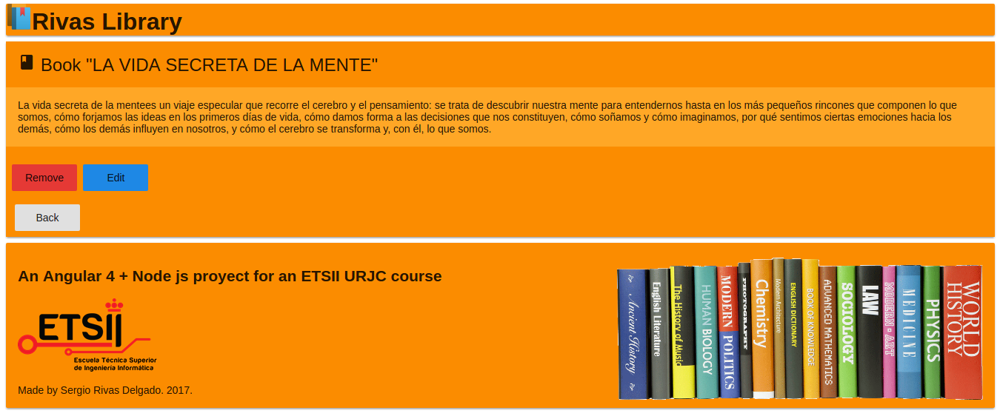

# Rivas-Library 

### An Angular 4 + Node.js application based in a books library

### Getting started
* __Previous Requirements.__   
  * Node version 6.8.0.
  * Npm version 4.2.0.

* __Here you have the instructions to use the app.__   
  * Clone the repo using git clone .
  * Type the command 'node nodeBackend' in NodeBackend folder .
  * The app will be running in http://localhost:8080 .

### Screenshots
* __Book List__
    

* __Book Edit__
    

* __Book Detail__
    

* __New Book__
    
